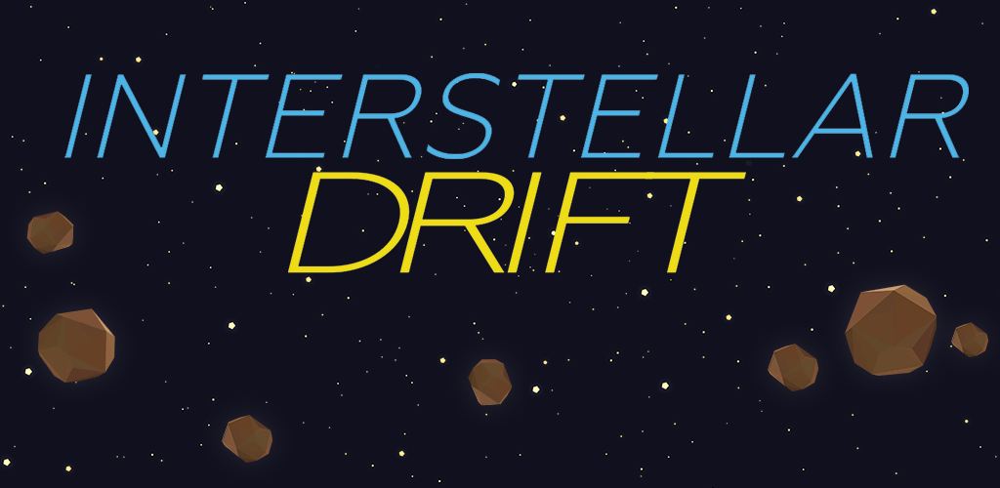

# Interstellar Drift
Interstellar Drift is a mobile game created in [Unity](http://unity3d.com/) by Trollpants Game Studio in 2015.

## Open Source Release
As Trollpants is no more, I ([Jan Ivar Z. Carlsen](https://github.com/jizc)) have decided to release the game as open source. This is mainly to preserve the game, but I hope this may also help other indie devs who are just getting started.

I have rewritten parts of the source code for this release. This was both to clean it up and to get rid of some dependencies.

## Release History
Interstellar Drift was released on Google Play, Apple App Store and Amazon Appstore on July 14th, 2015.

## CloudOnce
[CloudOnce](https://github.com/jizc/CloudOnce) was used to implement [Google Play Game Services](https://developers.google.com/games/services/), [Apple Game Center](https://developer.apple.com/game-center/) and [Amazon GameCirle](https://developer.amazon.com/gamecircle).

## Other Trollpants Game Studio games
* [Witch Wing](https://github.com/jizc/WitchWing)
* [52 Swipe Up](https://github.com/jizc/52SwipeUp)
* [Mini Planet Run](https://github.com/jizc/MiniPlanetRun)
* [Bucket Knight: River Adventures](https://github.com/jizc/BucketKnight)

## License
The contents of this project is licensed under the MIT license, unless other is specified in file header. See [LICENSE file](./LICENSE) in the project root for full license information.
