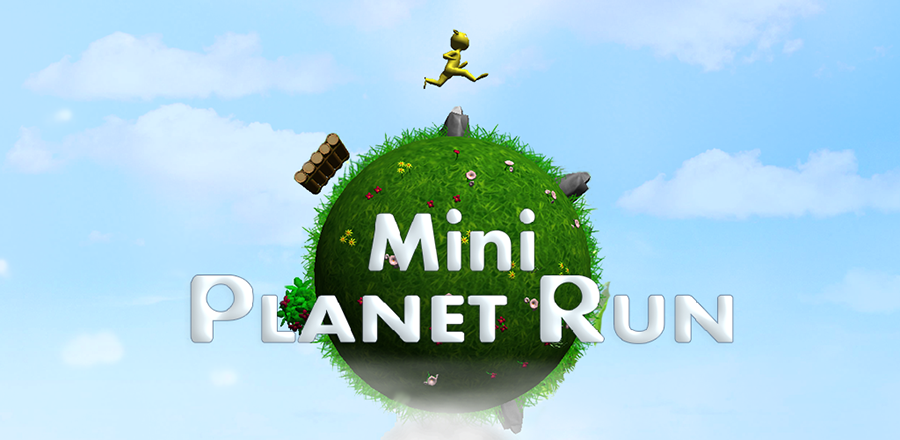

# Mini Planet Run
Mini Planet Run is an endless runner mobile game created in [Unity](http://unity3d.com/) by [Trollpants Game Studio](https://github.com/jizc/Trollpants) in 2015.

## Release History
Mini Planet Run was released on both Google Play and Apple App Store on Febuary 18th, 2015.

## CloudOnce
[CloudOnce](https://github.com/jizc/CloudOnce) was used to implement [Google Play Game Services](https://developers.google.com/games/services/) and [Apple Game Center](https://developer.apple.com/game-center/).

## License
The contents of this project is licensed under the MIT license, unless other is specified in file header. See [LICENSE file](./LICENSE) in the project root for full license information.
